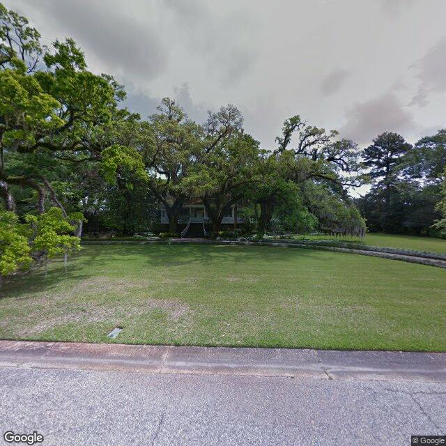

# StudentScraper 

## By Nathan Cheshire

Student Scraper is a web scraping tool that uses Python and Selenium to scrape student details from MSU's student directory, and folium/leaflet-js for visualizations. I plan to use deckgl in the future for better and 3D visualizations.

### Setup

For this stack, make sure you can execute python scripts and have Docker Desktop installed (WLS is of course recommended). We're going to use Docker for the Postgres instance and Python for general purpose scripting. Additionally, I have provided a `PostgresSetup.bat` which will do all the work of setting up Postgres and creating the appropriate database and table.

After the Postgres intance is up and running in a Docker container, and you have ensured the database and table were created successfully, place your username and password for MSU inside of `Keys/state.key` in the format: `netid,password`. This will be used with selenium to send a DUO push to obtain cookies which will allow the sending of mass POST requests. Make sure you accept this DUO push on your phone.

Lastly, following completion of the setup, you may invoke `Poster.py` which will begin the POSTing sequence and insertions into the Dockerized Postgres instance.

To obtain the `lat,lon` pairs which correspond to student addresses, obtain a MapQuest API key and use that in combination with `MapQuest.py` to convert the stored addresses into lat,lon pairs. MapQuest free tier only allows 15K queries so you'll most likely need a second account for this step (use [ProtonMail](https://proton.me/mail), Gmail, or some other quick and easy email service).

## Results

### Figure 1 - Aerial Address Generation

 

### Figure 2 - Street Route Plotting

 

### Figure 3 - Heatmap

Utilizing all of the lat,lon pairs outputed via the `MapQuest.py` script, I used Follium (Python version of leaflet.js) to generate a heatmap of all students who had public addresses that attended MSU during the Fall 2021 semester. The Visualization for this can be seen at the following link: 
<b>https://nathancheshire.github.io/StudentHeatFall2021</b>

### Figure 4 - Google Stree View

As can be seen in `MapGenerator.py`, a method exists called `generateStreetViewImage()`. Using this method, which simply takes a netid, I can produce a figure showing the student a picture of their house as if I was standing outside. In testing this works for <=70% for all students; a number I find acceptable. The lack of absolute correctness comes from google street addressing not always being accurate as well as some people having PO boxes or a [CMRA](https://faq.usps.com/s/article/Mail-Services-at-Non-Postal-Sites-CMRA#:~:text=Provider%20Goes%20Out%20of%20Business,location%20with%20newly%20paid%20postage.). I plan to make the backend I've collected accessible via a Cyder account..

<b>Input: lm2112</b>

